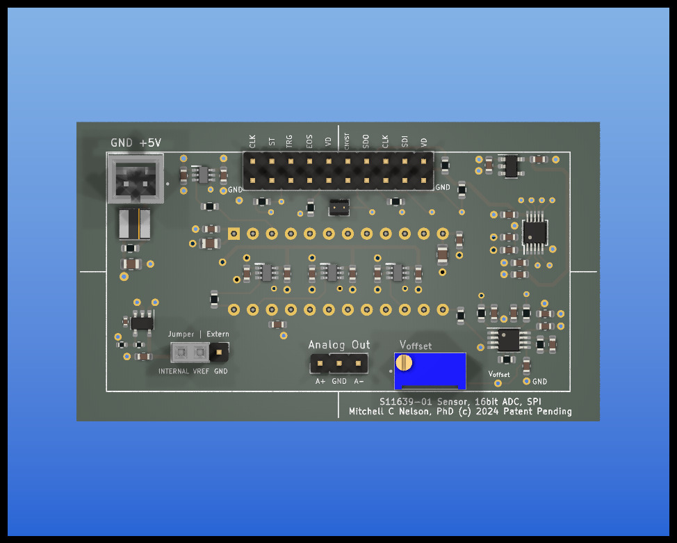

# S11639-01-Linear-CCD-PCB-and-Code
This repo provides electronics, firmware and host software for the Hamamatsu S11639-01, a linear CCD sensor that has high sensitivity at 1300V/lx s and low dark noise at 0.2mV (for a 10msec exposure).  With saturation at 2V, the dynamic range is 10,000.
The electrical design is implemented as a two board set, sensor and controller, for mechanical stability and interchangeability.
The sensor board has the socketed sensor, logic gates to drive the pins, and a low noise all differential analog section with a high precision differential 16 bit ADC.
The controller operates the sensor and interacts with a host computer over USB, and has pins for trigger, gate, sync and busy signals.
The command interface is human readable ascii, data transfers are selectable in ascii or binary.

N.B.  This is an update to bring the S11639-0 board into compatibility with the new connector layout for our controller boards.   This design is not yet built, sponsors are welcome.  Please click the sponsor button at the top of the page.

*The original boards and their matching controllers are in the subdirecty labeled [Rev0Boards](./Rev0Boards).*

This version of the board is designed to be used with either of the our controllers, the [Teensy 4.0 based controller](https://github.com/drmcnelson/SPI-Instrumentation-Controller-T4.0) 
and the [Teensy 4.1 based controller](https://github.com/drmcnelson/SPI-Instrumentation-Controller-T4.1).
In principle, the S11639-01 could be used with a number of different Arduino boards.  After some extensive study anddetailed comparison, we prefer the Teensy 4.x boards.  These have good implementations for 16 bit transfers over SPI and they have 480MHz USB for fast transfers to the host computer.

The firmware, which runs in the controller, provides high end functionality including clocked, triggered, and gated operation.
In the firmware, codes that are specific to the sensor are in a separate c++ file and header.  The "sketch file" implements a command interface and calls the sensor code to do the "work" of collecting frames in various operating modes.  The codes throughout, use the standard Arduino libraries plus a small number of optional register level enhancements for the i.MX RT MCU that provide faster and more constant interrupt latency and SPI transfers with less overhead.

## Sensor board details
The following image shows the circuit side of the sensor board with the high precision low noise differential front end (dual opamp lower right, adjacent to the video out pin from the sensor) interfaced to a differential 16bit 1MSPS ADC, and logic level converters (center) for the external digital interface.
The sensor is socketed on the reverse side. 
SPI and logic signals are brought to the double row header at the top edge of the board (ribbon cable compatible).
The external logic level is set by VDD supplied by the controller card.
Power for the sensor and other circuit elements is 5V and supplied by a separate connector.
The small jumper top center near the double row header, selects whether the CNVST pin on the ADC is connected to the TRG signal from the sensor or to the host processor.
(The firmware at present assumes the CNVST pin is connected to the MCU.)
The jumper and header (lower left) selects the internal 4.096V reference or provides a connector for an external reference.
The output from the analog section is available on the three pin header center bottom.
The trim pot should be set to 1.6V for sensors meeting the "typical" spec with output from 0.6V to 2.6V, there is a test point next to the trim pot labeled Voffset where the offset voltage can be measured.

## T4.0 Controller board details
Please refer to the repo at 
The following describes the T4.0 based controller. The double row header across the top matches that on the sensor board.  The two boards should be connected by a ribbon cable that can be a few inches in length, and by a two wire cable for power, between the connectors labeled "5V" upper left on this board and upper left on the sensor board.  (The power cable will cross over the ribbon cable when the boards are positioned correctly and joined by a ribbon cable.)
The single row headers provides access to the digital interface signals and provides additional pins to the right for a trigger input, sync and busy ouputs and spare digital I/O pin.   The double row header on the left provides access to the onboard analog digital converters and any of these can be used for digitial I/O.  While all of these have diode protection, users should be cognizant that the Teensy is not 5V tolerant. 

Running the supplied sketch (see the Firmware directory), the controller appears as a serial port or com port with a human readable command interface.  There is a help command that produces a listing of all of the available commands.  The device can collect (a) single frames, (b) clocked series of frames, (c) triggered single frames, (d) triggered sets of clocked frames (i.e. triggered kinetic series), and (e) gated frames.  There are commands to set the sense (hi/low) of the trigger input and each of the digital outputs, and to set whether the sync output is asserted at the beginning of each frame or series.  There is a "hold off" that can be used to triggered an external device and then wait for a fixed time before collecting a frame.  Busy is asserted whenever the device is active and until data has been transferred to the host computer.   A Python utility and class library and a C language utility and library provide two options for working with the device and integrating into equipment and experiments 

## T4.1 Controller board details
The Teensy 4.1 controller is similar to the T4.0 version, but with more connectors.
In the following image, the long connector across the top corresponds to the 20 connector in the T4.0 controller.  This where the CCD connects. 
Filtered +5V power comes from the connector on the lower right.
The keyed connectors on the left, top and bottom are SPI interfaces 0 and 1.
Analog inputs are to the right of the SPI1 connector
Trigger, sync and busy are implemented in firmware on pins 0, 1, and 2.  These are brought out to a the double row header upper right, so that each pin has a ground pin.
The single row headers provide monitoring points and extended set of digital I/O pins.

## Example Spectrometer
The following shows a spectrometer built with the S11639-0 and a fluorescent lamp spectrum collected through an optical fiber and 200um slit and single 100ms exposure, with the fluorescent ceiling lamp at a distance of about 2 meters from the end of the fiber.  (At a 10ms exposure the background is 0.5mV as listed in the datasheet for the sensor.) The sensor board is mounted in a frame that allows adjustment to position the sensor on the focus.  The control board is mounted outside on the light tight cover, for easy access to the pins without disturibing the sensor board, and connected to the sensor board via a 5 inch long ribbon cable and power (twisted red and black wires). Notice that all of the optical mounts are 3-d printed.  The base plate was purchased on Amazon, the sma905 port, slit and lenses on ebay and the transmission grating from Thorlabs.

## Availability and Sponsorhip
This repo and its contents are provided without warranty or representation of suitability for any purpose whatsoever.

Feel free to build this for your own use or in your lab.  The intent is to support access to doing good science for those who are not as well funded as others.  Commercial use is subject to review and approval, per this criterion.

If you would like a preassembled board, please consider sponsoring and please contact me so that I can get a current cost of materials.

Sponsorship is very much appreciated.  Please click the sponsor button and help us make this and more devices available and support our effort to make doing science more accessible.

